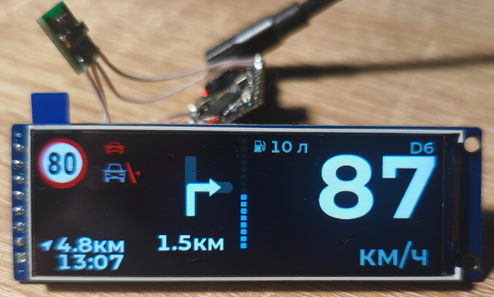
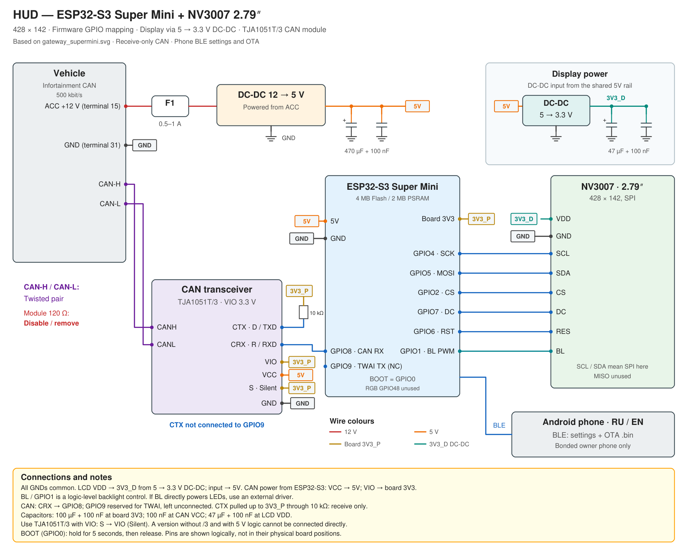

# HUD for Audi A4 B9 (MLB-Evo) — ESP32-S3 Super Mini / NV3007 2.79″ / BLE

[Русская версия](README_ru.md) · [Android companion app](https://github.com/WARMW00D/HUD-Audi-A4-B9-MLB-Evo-Android-App)

A DIY head-up display showing vehicle data from Audi I-CAN: speed, gear, ACC, speed limiter, driver assistance, traffic signs, doors and navigation. This is the compact **428 × 142 NV3007** adaptation of the [Waveshare 3.49″ project](https://github.com/WARMW00D/HUD-Audi-A4-B9-MLB-Evo-Waveshare-ESP32-S3-Touch-LCD-3.49), with Android settings and firmware updates over BLE.

**Firmware: v29.1. Android app: 1.3.** This repository contains firmware source and wiring diagrams. Android source lives in its own repository. No prebuilt firmware is included; Android APKs are available in the companion app release below.

## Tank capacity and acceleration bar

Source versions: **HUD firmware v29.1 / Android app 1.3 (versionCode 4)**.

- **Tank capacity:** enter a whole number from **1 to 200 litres**; default **54 L**. The capacity is always entered in litres, even with US gallons selected, and updates the HUD fuel-to-add calculation.
- **Acceleration bar:** turn it on or off from the app. When enabled, the existing bar uses valid acceleration/speed data; it remains empty while stationary or without valid data.
- Both settings are confirmed by BLE readback and saved in HUD NVS. Existing settings, phone owner and gateway bonds are retained. A BOOT phone-binding reset also retains these settings.

These controls need **app 1.3 + firmware v29.1**. App 1.3 still supports older firmware: missing controls are disabled. The APKs in release v1.2 do not include these controls; rebuild app 1.3. New binaries were not built here. If v29.0 and its OTA partition table are already installed, v29.1 uses the same layout; earlier firmware needs the initial USB/partition upgrade described below.

## HUD on hardware



Photo supplied by WARMW00D: speed, gear, speed-limit sign, navigation and fuel information on the NV3007 display.

## Download Android APK

[Version 1.2 release page](https://github.com/WARMW00D/HUD-Audi-A4-B9-MLB-Evo-Android-App/releases/tag/v1.2) — **Pre-release**, pending real-device OTA validation.

- [Release APK](https://github.com/WARMW00D/HUD-Audi-A4-B9-MLB-Evo-Android-App/releases/download/v1.2/HUD-Control-1.2-release.apk) — signed build for normal installation, 55,768 bytes.
- [Debug APK](https://github.com/WARMW00D/HUD-Audi-A4-B9-MLB-Evo-Android-App/releases/download/v1.2/HUD-Control-1.2-debug-test-only.apk) — 61,253 bytes; `testOnly=true`, install with `adb install -t HUD-Control-1.2-debug-test-only.apk`.
- [SHA-256 checksums](https://github.com/WARMW00D/HUD-Audi-A4-B9-MLB-Evo-Android-App/releases/download/v1.2/SHA256SUMS.txt).

Both are maintainer-supplied version 1.2 (versionCode 3). APK v2 signatures and content digests were verified. Release and debug use different signing keys: switching requires uninstalling the old app and removes its local settings. Keep the release signing key for future updates. OTA requires firmware v29.0 initially installed over USB with the two-slot partition table.

## What the HUD shows

| Element | Behaviour |
|---|---|
| Speed and gearbox | Cluster digital speed; P/R/N/D/S/M/E/Offroad and gear number when available |
| ACC and limiter | Set speed, ACC target and traffic jam assist; LIM replaces the ACC set-speed icon |
| Lane / Side Assist | Lane detection, steering and warnings; red lines for blind-spot indications |
| Traffic signs | Main sign: valid VZE → explicit PSD → PSD legal limit; additional signs cycle |
| Overspeed | Red outline around speed digits, based on the displayed main limit |
| Navigation | Main maneuver, next maneuver, distance, progress bar, destination distance and time |
| Doors / pre sense | Open vehicle parts replace navigation; pre sense has higher priority |
| Turn signals | Green arrows; hazard lights use red |
| Fuel | Amount to fill and consumption strip when the required data is available |
| Acceleration | Optional bar, selected by build-time configuration |
| Brightness | Vehicle light sensor × dimmer wheel; night range **2–40**, sunlight **200–255** |
| Settings | PSD, VZE, HUD language, distance/speed units and fuel-volume units; stored in NVS |

Stale fields are hidden. A signal must exist on your car’s bus to be displayed. This board has no Waveshare touch controller, audio codec or SD logging; settings use the phone. The phone app language is independent of the HUD language.

## Architecture

The HUD decodes raw frames locally using `can_decode.c`. Select the source in `supermini_hud/hud_config.h`:

| Mode | Source |
|---|---|
| `HUD_SRC_AUTO` — default | Own CAN while frames arrive; after 1 s of silence, use the BLE gateway |
| `HUD_SRC_TWAI` | Direct CAN through TJA1051T/3, TWAI `LISTEN_ONLY` |
| `HUD_SRC_BLE` | Raw CAN frames from a compatible gateway / sniffer |
| `HUD_SRC_FAKE` | Built-in generator for bench testing |

The [CAN sniffer / BLE gateway](https://github.com/WARMW00D/esp32-CAN-sniffer-logger-screener) uses the ACL protocol (firmware 2.6.0+). The HUD sends its ACL after every gateway connection. Phone settings and OTA are separate GATT services; NimBLE acts as both gateway client and phone server. First-time gateway pairing waits if the phone is connected.

LVGL renders a compact 518 × 172 canvas, uniformly scales it to 428 × 142, and sends changed strips over SPI. Display code uses PSRAM; no LVGL calls should be added from BLE callbacks.

[CAN signals and gateway protocol](docs/CAN.md) · [BLE settings, Russian](supermini_hud/BLE_SETTINGS_ru.md)

## Hardware and wiring

- **ESP32-S3 Super Mini:** the project targets the supplied 4 MB Flash / 2 MB QSPI PSRAM board. Check your board variant.
- **NV3007 2.79″:** 428 × 142, SPI, with a logic backlight-control input.
- **TJA1051T/3:** VIO-equipped CAN module with a 3.3 V logic interface.
- ACC 12 V → external DC-DC 12→5 V. The 5 V rail supplies the ESP32 board and the **input** of a separate DC-DC 5→3.3 V for the display.

**Display VDD comes from the separate converter’s 3.3 V output (`3V3_D`). Do not connect that output to the board’s 3V3 pin (`3V3_P`).** All grounds are common. CAN-module VCC comes from the board’s 5V pin; VIO and S come from the board’s 3V3 pin. SN65HVD230 is not used.



[Editable SVG](schematics/HUD_supermini_NV3007_rev3_en.svg) · [PDF](schematics/HUD_supermini_NV3007_rev3_en.pdf)

| ESP32-S3 | Connection |
|---|---|
| GPIO4 | LCD SCL / SPI SCK |
| GPIO5 | LCD SDA / SPI MOSI |
| GPIO2 | LCD CS |
| GPIO7 | LCD DC |
| GPIO6 | LCD RES |
| GPIO1 | LCD BL / PWM |
| GPIO8 | CAN CRX / RXD |
| GPIO9 | TWAI TX reservation — leave physically unconnected |
| GPIO0 | On-board BOOT button |

CAN CTX/TXD → 10 kΩ → board 3V3; S → VIO for silent mode. CAN-H / CAN-L are a twisted pair. Disable the module’s 120 Ω termination when connecting to an already terminated vehicle bus. Receive-only protection combines TWAI `LISTEN_ONLY`, disconnected GPIO9 and hardware silent mode. SCL/SDA labels on this display refer to SPI, not I²C; MISO is unused. If BL directly powers LEDs instead of being a logic input, use a suitable external driver.

The drawing is a wiring diagram, not a PCB layout or a complete automotive power-protection design. USB power isolation is not drawn; account for it when flashing while external 5 V is connected.

## Build and first USB installation

Open `supermini_hud/supermini_hud.ino` in Arduino IDE. Keep the sketch-folder name `supermini_hud`.

| Item | Project configuration |
|---|---|
| Board | ESP32S3 Dev Module |
| Arduino ESP32 core | 3.3.10, as in the supplied working board configuration |
| CPU | 240 MHz |
| Flash | 4 MB, QIO / 80 MHz, matching your working board |
| PSRAM | QSPI, 2 MB; not OPI |
| USB CDC On Boot | Enabled |
| Partition table | Custom `supermini_hud/partitions.csv` |
| Serial | 115200 |
| Libraries | LVGL 8.4.0; NimBLE-Arduino 2.x / API 2.5.1; Arduino_GFX with `Arduino_NV3007` support |

Put `supermini_hud/config/lv_conf.h` next to the installed `lvgl/` directory. Required: `LV_COLOR_DEPTH 16`, `LV_USE_FONT_COMPRESSED 1`. LVGL 9 is not supported. Both `LV_COLOR_16_SWAP` settings are handled by the display port.

**Upgrading v28.x → v29.0 requires USB flashing of the new partition table. Set Erase All Flash to Disabled.** Confirm the build uses the supplied CSV and writes the table at 0x8000; flashing only the application does not migrate partitions. NVS remains at 0x9000 with size 0x5000, so settings and bonds are intended to survive, subject to device verification.

Two OTA slots are **0x1F0000 / 2,031,616 bytes** each. Check the compiled application size. The first boot should report `[fw] HUD Super Mini v29.0 / BLE OTA` and a next-slot capacity of 2031616.

For gateway authentication, copy `secrets.example.h` to `secrets.h` and set its `BLE_PASSKEY` to match the gateway. `secrets.h` is ignored by Git. This is separate from the phone PIN, `HUD_SETTINGS_PIN` in `user_config.h`.

## Android settings and BLE OTA

1. Download the APK above or build and install the [Android app](https://github.com/WARMW00D/HUD-Audi-A4-B9-MLB-Evo-Android-App).
2. Find `HUD-SuperMini`, connect and complete Android bonding. Phone pairing PIN: see `HUD_SETTINGS_PIN` in [`user_config.h`](supermini_hud/user_config.h).
3. The first authenticated phone becomes the owner. Settings changes are read back and stored in NVS.
4. For OTA, export **`supermini_hud.ino.bin`** from Arduino IDE. Select that application image in the app, then confirm the update.
5. Keep power stable and the phone app open. After verification and boot-slot selection, the HUD reboots; reconnect and check operation.

Do not use bootloader, partition, merged images or flash dumps for OTA. The transfer validates offsets, SHA-256, the ESP32-S3 application header and the ESP-IDF image before selecting the new slot. Only the bonded, authenticated owner may update. A lost final acknowledgment can mean the update has already committed; follow the app’s restart/check message before retrying. Functional rollback of a faulty new program is not guaranteed; USB is the recovery method.

To replace the phone: while the HUD is running, hold **BOOT for 5 s and release**. Only the phone ownership/bonds are reset; HUD settings and gateway keys remain. Remove the old HUD bond on the phone before pairing again. Do not hold BOOT during power-on/reset.

[Full OTA guide](docs/OTA.md) · [Полная инструкция OTA](docs/OTA_ru.md)

## Configuration and diagnostics

`user_config.h` defines LCD GPIO, orientation, column offsets, SPI clock, phone name/PIN and BOOT. `hud_config.h` defines data source, sign selection defaults, units, tank size, brightness and Serial logging. Stored phone settings override initial defaults.

| Setting | Default |
|---|---|
| `HUD_CAN_RX_PIN` / `HUD_CAN_TX_PIN` | 8 / 9, with TX unconnected |
| `HUD_CAN_BITRATE_K` | 500 |
| `HUD_LCD_SPI_HZ` / `HUD_LCD_ROTATION` | 20 MHz / 1 |
| `HUD_BR_DARK_WHEEL_MIN` / `_MAX` | 2 / 40 |
| `HUD_BR_BRIGHT_WHEEL_MIN` / `_MAX` | 200 / 255 |
| `HUD_LANG` / `HUD_UNITS` | RU / km |
| `HUD_TANK_L` | 54 L |

For bench testing, use `HUD_SRC_FAKE` or a compatible BLE log player. Enable `HUD_LOG_CAN` / `HUD_LOG_STAT` to diagnose missing frames; a field disappearing on timeout does not necessarily indicate a rendering problem. Use `tools/can_bitdiff.py` to inspect changing CAN bits.

| Symptom | Check |
|---|---|
| Custom text missing | `LV_USE_FONT_COMPRESSED 1` and LVGL 8 |
| Black screen / allocation error | QSPI PSRAM enabled, GPIO, power, LCD rotation and column offsets |
| No gateway data | Gateway ACL protocol, name, bonding/passkey and source mode |
| OTA service absent | Install v29.0 over USB; reconnect after Service Changed; check slot capacity |
| App reconnect fails after removing Android bond | Reset phone ownership with BOOT, then pair again |

## Validation status

The user reported that the earlier SuperMini HUD and Android settings app worked. **v29.0 OTA has host tests but still needs an ESP32 build and real-device transfer test.** Maintainer-supplied Android v1.2 APKs are published; their signatures and integrity were verified. Builds were not run here; Android lint results remain pending.

Host tests cover real SHA-256 through OpenSSL with mocked NimBLE/ESP-IDF: full transfer, commit only after verification, invalid size/header/chip/hash, flash failures, offsets, cancel/disconnect/timeout, owner authorization, duplicate commit and lost final ACK. Display scaling, dirty strips, decoder and settings/NVS also have host tests. Mocks do not establish real BLE interoperability or flash reliability.

Example from `supermini_hud/` (g++ and OpenSSL development headers required):

```sh
g++ -std=c++17 -Wno-deprecated-declarations -Itests/settings_stubs tests/test_ble_ota.cpp -lcrypto -o /tmp/hud_test_ota
/tmp/hud_test_ota
g++ -std=c++17 -Wno-deprecated-declarations -Itests/settings_stubs tests/test_ble_settings.cpp -lcrypto -o /tmp/hud_test_settings
/tmp/hud_test_settings
```

CAN signal verification depends on the vehicle and equipment. The inherited observations and remaining uncertainties are in [CAN reference](docs/CAN.md). Firmware integrity checks are not a digital signature or proof that a third-party ESP32-S3 image is compatible.

## Files

- `supermini_hud/` — Arduino sketch, decoder, LVGL interface, SPI port, BLE gateway client, phone settings and OTA server.
- `supermini_hud/config/` — LVGL configuration example.
- `supermini_hud/tests/` — host tests and stubs.
- `supermini_hud/tools/` — image/font generators, previews and CAN utilities.
- `docs/` — OTA and CAN/gateway guides in English and Russian.
- `schematics/` — Russian and English revision 3 SVG, PNG and PDF with the Infortainment CAN label; display DC-DC input is 5 V. Revision 2 remains available.

## Credits and license

- **WARMW00D (Warmwood):** project owner, hardware integration, vehicle logs and testing.
- **Claude (Anthropic):** development assistance acknowledged by the original Waveshare project.
- **OpenAI Codex / ChatGPT:** assistance with the SuperMini/NV3007 adaptation, BLE settings, Android RU/EN app, BLE OTA, host tests, wiring diagrams and documentation. Generated changes still require maintainer review and hardware validation.
- [CAN sniffer/gateway](https://github.com/WARMW00D/esp32-CAN-sniffer-logger-screener), opendbc/openpilot and revag-bap — data transport and signal/protocol references.
- Waveshare — original project context; Arduino_GFX, LVGL and NimBLE-Arduino — display and BLE libraries.
- Montserrat and Roboto Condensed — fonts under SIL OFL 1.1, licenses in `supermini_hud/tools/fonts/`.

Project code and documentation: [MIT](LICENSE), retaining the original Warmwood copyright. Third-party assets retain their own licenses; the original README notes that `tools/icons/acc_set.png` came from an external source. This hobby project is not affiliated with AUDI AG or Volkswagen AG.
