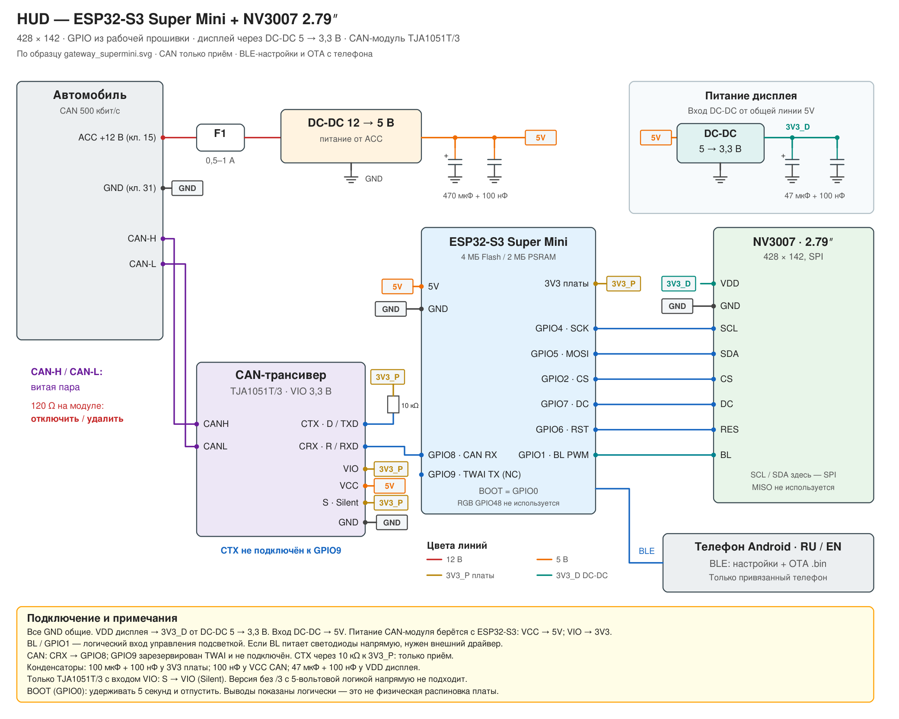

# HUD для Audi A4 B9 (MLB-Evo) — ESP32-S3 Super Mini / NV3007 2.79″ / BLE

[English](README.md) · [Приложение Android](https://github.com/WARMW00D/HUD-Audi-A4-B9-MLB-Evo-Android-App)

Самодельный HUD показывает данные Audi I-CAN: скорость, передачу, ACC, лимитер, ассистентов, дорожные знаки, двери и навигацию. Это компактная адаптация [проекта Waveshare 3.49″](https://github.com/WARMW00D/HUD-Audi-A4-B9-MLB-Evo-Waveshare-ESP32-S3-Touch-LCD-3.49) под **NV3007 428 × 142**, с настройками и обновлением прошивки по BLE через Android.

**Прошивка: v29.0. Приложение: 1.2.** Здесь исходники прошивки и схема соединений. Android вынесен в отдельный репозиторий. Готовые `.bin` не приложены; APK доступны в релизе приложения по ссылкам ниже.

## Скачать APK Android

[Версия 1.2](https://github.com/WARMW00D/HUD-Audi-A4-B9-MLB-Evo-Android-App/releases/tag/v1.2) — **Pre-release**, до проверки OTA на реальных устройствах.

- [Release APK](https://github.com/WARMW00D/HUD-Audi-A4-B9-MLB-Evo-Android-App/releases/download/v1.2/HUD-Control-1.2-release.apk) — подписанная сборка для обычной установки, 55 768 байт.
- [Debug APK](https://github.com/WARMW00D/HUD-Audi-A4-B9-MLB-Evo-Android-App/releases/download/v1.2/HUD-Control-1.2-debug-test-only.apk) — 61 253 байт; `testOnly=true`, установка: `adb install -t HUD-Control-1.2-debug-test-only.apk`.
- [Контрольные суммы SHA-256](https://github.com/WARMW00D/HUD-Audi-A4-B9-MLB-Evo-Android-App/releases/download/v1.2/SHA256SUMS.txt).

Обе сборки предоставлены владельцем: версия 1.2 (versionCode 3). Подписи APK v2 и целостность проверены. Release и debug подписаны разными ключами: для смены нужно удалить старое приложение, его локальные настройки будут потеряны. Сохраните ключ release-подписи для будущих обновлений. OTA требует v29.0, впервые установленную через USB с двумя OTA-разделами.

## Что показывает HUD

| Элемент | Поведение |
|---|---|
| Скорость и КП | Цифровая скорость приборки; P/R/N/D/S/M/E/Offroad и номер передачи, если доступен |
| ACC и лимитер | Установленная скорость, цель впереди, режим пробки; LIM вместо значка установки ACC |
| Lane / Side Assist | Линии полосы, удержание и предупреждения; красные линии для мёртвых зон |
| Знаки | Основной знак: действующий VZE → явный PSD → PSD по правилам; дополнительные меняются по кругу |
| Превышение | Красная обводка скорости относительно основного отображаемого ограничения |
| Навигация | Основной и следующий манёвры, дистанция, шкала, расстояние и время до цели |
| Двери / pre sense | Открытые части машины вместо навигации; pre sense имеет приоритет |
| Поворотники | Зелёные стрелки; аварийка — красные |
| Топливо | Объём долива и полоса расхода при наличии нужных данных |
| Ускорение | Опциональная шкала, включается в конфигурации сборки |
| Яркость | Датчик освещённости машины × колёсико; ночью **2–40**, на солнце **200–255** |
| Настройки | PSD, VZE, язык HUD, единицы скорости/дистанции и объёма; сохраняются в NVS |

Поля с устаревшими данными скрываются. Отображение зависит от наличия сигналов на шине конкретной машины. В этой версии нет сенсора, аудиокодека и SD-журнала Waveshare; настройки меняются с телефона. Язык приложения выбирается отдельно от языка HUD.

## Архитектура

HUD декодирует сырые кадры локально в `can_decode.c`. Источник выбирается в `supermini_hud/hud_config.h`:

| Режим | Источник |
|---|---|
| `HUD_SRC_AUTO` — по умолчанию | Свой CAN, пока идут кадры; после 1 с тишины — BLE-шлюз |
| `HUD_SRC_TWAI` | Прямой CAN через TJA1051T/3, TWAI `LISTEN_ONLY` |
| `HUD_SRC_BLE` | Сырые CAN-кадры совместимого шлюза / сниффера |
| `HUD_SRC_FAKE` | Встроенный генератор для стенда |

[Сниффер / BLE-шлюз](https://github.com/WARMW00D/esp32-CAN-sniffer-logger-screener) использует ACL-протокол, прошивка 2.6.0+. HUD передаёт ACL после каждого соединения. Настройки телефона и OTA — отдельные GATT-сервисы; NimBLE одновременно работает клиентом шлюза и сервером телефона. Первое PIN-сопряжение шлюза откладывается, если подключён телефон.

LVGL рисует компактный холст 518 × 172, равномерно масштабирует его до 428 × 142 и отправляет изменившиеся полосы по SPI. Буферы используют PSRAM. Не добавляйте вызовы LVGL из BLE callbacks.

[Сигналы CAN и протокол шлюза](docs/CAN_ru.md) · [Настройки BLE](supermini_hud/BLE_SETTINGS_ru.md)

## Железо и подключение

- **ESP32-S3 Super Mini:** проект рассчитан на предоставленную плату с 4 MB Flash / 2 MB QSPI PSRAM. Сверьте вариант своей платы.
- **NV3007 2.79″:** 428 × 142, SPI, логический вход управления подсветкой.
- **TJA1051T/3:** CAN-модуль с VIO и логическим интерфейсом 3,3 В.
- ACC 12 В → внешний DC-DC 12→5 В. Общая линия 5V питает ESP32 и **вход** отдельного DC-DC 5→3,3 В для дисплея.

**VDD дисплея получает 3,3 В от отдельного преобразователя (`3V3_D`). Его выход не соединяется с 3V3 платы (`3V3_P`).** Все GND общие. CAN VCC питается от 5V платы; VIO и S — от 3V3 платы. SN65HVD230 не используется.



[Редактируемый SVG](schematics/HUD_supermini_NV3007_rev2_DCDC.svg) · [PDF](schematics/HUD_supermini_NV3007_rev2_DCDC.pdf)

| ESP32-S3 | Подключение |
|---|---|
| GPIO4 | LCD SCL / SPI SCK |
| GPIO5 | LCD SDA / SPI MOSI |
| GPIO2 | LCD CS |
| GPIO7 | LCD DC |
| GPIO6 | LCD RES |
| GPIO1 | LCD BL / PWM |
| GPIO8 | CAN CRX / RXD |
| GPIO9 | Резерв TWAI TX — физически не подключать |
| GPIO0 | Встроенная кнопка BOOT |

CAN CTX/TXD → 10 кΩ → 3V3 платы; S → VIO для silent mode. CAN-H / CAN-L — витая пара. Терминацию 120 Ω модуля отключить при подключении к уже терминированной шине автомобиля. Только приём обеспечивается режимом TWAI `LISTEN_ONLY`, неподключённым GPIO9 и аппаратным Silent. SCL/SDA дисплея здесь означают SPI, а не I²C; MISO не используется. Если BL напрямую питает светодиоды, а не является логическим входом, нужен подходящий внешний драйвер.

Это схема соединений, не разводка PCB и не полная схема автомобильной защиты питания. Развязка USB-питания не показана; учитывайте её при прошивке с подключённым внешним 5V.

## Сборка и первая установка через USB

Открыть `supermini_hud/supermini_hud.ino` в Arduino IDE. Имя папки скетча должно остаться `supermini_hud`.

| Параметр | Конфигурация проекта |
|---|---|
| Плата | ESP32S3 Dev Module |
| Arduino ESP32 core | 3.3.10, как в предоставленной рабочей конфигурации |
| CPU | 240 MHz |
| Flash | 4 MB, QIO / 80 MHz, согласно рабочим параметрам платы |
| PSRAM | QSPI, 2 MB; не OPI |
| USB CDC On Boot | Enabled |
| Таблица разделов | Свой файл `supermini_hud/partitions.csv` |
| Serial | 115200 |
| Библиотеки | LVGL 8.4.0; NimBLE-Arduino 2.x / API 2.5.1; Arduino_GFX с `Arduino_NV3007` |

Разместить `supermini_hud/config/lv_conf.h` рядом с установленной папкой `lvgl/`. Обязательно: `LV_COLOR_DEPTH 16`, `LV_USE_FONT_COMPRESSED 1`. LVGL 9 не поддерживается. Драйвер учитывает оба варианта `LV_COLOR_16_SWAP`.

**Переход v28.x → v29.0 впервые делается через USB с новой таблицей разделов. Erase All Flash = Disabled.** Проверить применение CSV из проекта и запись таблицы по адресу 0x8000; один app `.bin` не меняет разметку. NVS остаётся на 0x9000 размером 0x5000: настройки и сопряжения должны сохраниться, но это необходимо подтвердить на устройстве.

Два OTA-раздела по **0x1F0000 / 2 031 616 байт**. Проверить размер после сборки. При запуске ожидаются `[fw] HUD Super Mini v29.0 / BLE OTA` и capacity следующего раздела 2031616.

Для защищённого шлюза скопировать `secrets.example.h` в `secrets.h` и задать тот же `BLE_PASSKEY`, что на шлюзе. `secrets.h` исключён из Git. PIN телефона `HUD_SETTINGS_PIN` в `user_config.h` — отдельный код.

## Настройки Android и BLE OTA

1. Скачать APK выше либо собрать и установить [Android-приложение](https://github.com/WARMW00D/HUD-Audi-A4-B9-MLB-Evo-Android-App).
2. Найти `HUD-SuperMini`, подключиться и завершить системное сопряжение. PIN телефона по умолчанию: **482731**.
3. Первый аутентифицированный телефон становится владельцем. Изменения настроек читаются обратно и сохраняются в NVS.
4. Для OTA экспортировать **`supermini_hud.ino.bin`** из Arduino IDE. Выбрать этот app-образ в приложении и подтвердить обновление.
5. Сохранять стабильное питание и открытое приложение. После проверки и выбора boot-раздела HUD перезапустится; подключиться вновь и проверить работу.

Для OTA не подходят bootloader, partitions, merged-образ и полный дамп. Проверяются смещения, SHA-256, заголовок приложения ESP32-S3 и образ ESP-IDF до выбора нового раздела. Доступ — только сохранённому аутентифицированному владельцу. Потеря финального подтверждения может означать, что раздел уже переключён: дождаться перезапуска и проверить HUD перед повтором. Автоматический откат неисправной новой программы не гарантируется; восстановление — через USB.

Для смены телефона: на работающем HUD удерживать **BOOT 5 с и отпустить**. Сбрасываются только владелец и ключи телефона; настройки HUD и ключи шлюза остаются. Удалить прежнее сопряжение на телефоне перед повторной привязкой. Не держать BOOT при включении питания/reset.

[Полная инструкция OTA](docs/OTA_ru.md) · [OTA guide in English](docs/OTA.md)

## Конфигурация и диагностика

`user_config.h`: GPIO LCD, ориентация, смещения, частота SPI, имя/PIN телефона и BOOT. `hud_config.h`: источник данных, начальные настройки знаков/единиц, бак, яркость и Serial-журнал. Сохранённые настройки телефона имеют приоритет над начальными константами.

| Настройка | По умолчанию |
|---|---|
| `HUD_CAN_RX_PIN` / `HUD_CAN_TX_PIN` | 8 / 9, TX не подключён |
| `HUD_CAN_BITRATE_K` | 500 |
| `HUD_LCD_SPI_HZ` / `HUD_LCD_ROTATION` | 20 MHz / 1 |
| `HUD_BR_DARK_WHEEL_MIN` / `_MAX` | 2 / 40 |
| `HUD_BR_BRIGHT_WHEEL_MIN` / `_MAX` | 200 / 255 |
| `HUD_LANG` / `HUD_UNITS` | RU / km |
| `HUD_TANK_L` | 54 л |

Для стенда использовать `HUD_SRC_FAKE` или совместимый BLE-проигрыватель логов. `HUD_LOG_CAN` / `HUD_LOG_STAT` помогают искать пропавшие кадры; скрытие поля по таймауту не обязательно означает ошибку графики. `tools/can_bitdiff.py` показывает меняющиеся биты CAN.

| Симптом | Что проверить |
|---|---|
| Нет текста кастомными шрифтами | `LV_USE_FONT_COMPRESSED 1`, LVGL 8 |
| Чёрный экран / ошибка памяти | QSPI PSRAM, GPIO, питание, ориентация и смещения LCD |
| Нет данных шлюза | ACL-протокол, имя, сопряжение/passkey и режим источника |
| Нет OTA-сервиса | Установка v29.0 через USB, переподключение после Service Changed, capacity |
| Нет подключения после удаления Android bond | Сбросить владельца BOOT, затем сопрячь заново |

## Статус проверок

Пользователь подтвердил работу предыдущей версии SuperMini и приложения настроек. **OTA v29.0 имеет host-тесты; сборка ESP32 и передача на реальных устройствах ещё требуют проверки.** Опубликованы APK Android v1.2 от владельца, их подписи и целостность проверены. Здесь сборки не запускались; результаты lint Android ещё требуются.

Host-тесты с настоящим SHA-256 через OpenSSL и заглушками NimBLE/ESP-IDF: полная передача, переключение только после проверки, неверные размер/заголовок/чип/hash, ошибки Flash, смещения, отмена/обрыв/таймаут, доступ владельца, повтор COMMIT и потеря последнего ACK. Есть также тесты масштаба, изменившихся полос, декодера и настроек/NVS. Заглушки не подтверждают работу реального BLE и Flash.

Пример из `supermini_hud/` (нужны g++ и заголовки OpenSSL):

```sh
g++ -std=c++17 -Wno-deprecated-declarations -Itests/settings_stubs tests/test_ble_ota.cpp -lcrypto -o /tmp/hud_test_ota
/tmp/hud_test_ota
g++ -std=c++17 -Wno-deprecated-declarations -Itests/settings_stubs tests/test_ble_settings.cpp -lcrypto -o /tmp/hud_test_settings
/tmp/hud_test_settings
```

Проверка CAN зависит от машины и комплектации. Наблюдения исходного проекта и неизвестные сигналы указаны в [справочнике CAN](docs/CAN_ru.md). Контроль целостности не является цифровой подписью или гарантией совместимости сторонней прошивки ESP32-S3.

## Структура файлов

- `supermini_hud/` — скетч Arduino, декодер, интерфейс LVGL, SPI-драйвер, BLE-клиент шлюза, настройки телефона и OTA-сервер.
- `supermini_hud/config/` — пример конфигурации LVGL.
- `supermini_hud/tests/` — host-тесты и заглушки.
- `supermini_hud/tools/` — генераторы графики/шрифтов, превью и утилиты CAN.
- `docs/` — инструкции OTA и CAN/шлюза на русском и английском.
- `schematics/` — SVG, PNG, PDF ревизии 2; вход DC-DC дисплея от 5V.

## Участники и лицензия

- **WARMW00D (Warmwood):** владелец проекта, интеграция железа, автомобильные логи и испытания.
- **Claude (Anthropic):** помощь в разработке исходного проекта Waveshare, указанная в его README.
- **OpenAI Codex / ChatGPT:** помощь с адаптацией SuperMini/NV3007, настройками BLE, Android RU/EN, BLE OTA, host-тестами, схемой и документацией. Изменения требуют проверки владельцем проекта и испытаний на железе.
- [CAN-сниффер/шлюз](https://github.com/WARMW00D/esp32-CAN-sniffer-logger-screener), opendbc/openpilot и revag-bap — транспорт данных и справочники сигналов/протоколов.
- Waveshare — исходный проект; Arduino_GFX, LVGL и NimBLE-Arduino — библиотеки дисплея и BLE.
- Montserrat и Roboto Condensed — SIL OFL 1.1, лицензии в `supermini_hud/tools/fonts/`.

Код и документация: [MIT](LICENSE), исходный copyright Warmwood сохранён. Сторонние ресурсы сохраняют свои лицензии; исходный README отмечает внешнее происхождение `tools/icons/acc_set.png`. Любительский проект не связан с AUDI AG / Volkswagen AG.
